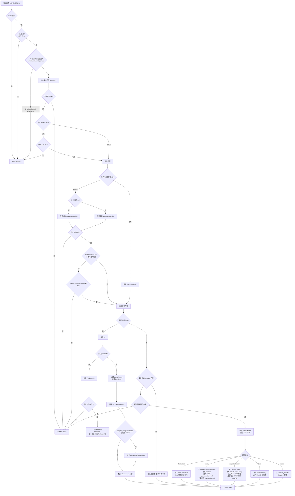

# sub-server

基于文件的简单订阅服务器。

主要为了方便在配置文件完全自己编写的情况下，快速导入 Surge、QuantumultX、Loon 等客户端。

同时也为了与家人或亲友分享时，隐藏原始订阅地址，避免被滥用。

## 编译

```bash
git clone https://github.com/alecthw/simple-sub-server.git
cd simple-sub-server
export GOOS=linux GOARCH=amd64 # 可选，交叉编译
go build -o sub-server
```

## 使用

配置文件存放：`{workdir}/sub/{uuid}/{file}`。

`uuid`必须是合法的uuid，做了校验。

代码中做了防越级处理，不能添加父子路径，即 `file` 的值中不能包含字符 `/` 、 `\` 和 `..` 。

请求url：`http://127.0.0.1:8080/{uuid}/{file}`。

### 请求处理流程



### 运行

```bash
./sub-server -dir /path/to/workDir -host 127.0.0.1:8080 -subcnv "http://127.0.0.1:25500"
```

### 工作目录示例

```txt
{workdir}
├── sub
│   ├── 56d00b21-554d-5a90-6daa-52537050fb20
│   │   ├── Loon.conf
│   │   ├── QuantumultX.conf
│   │   ├── Stash.yaml
│   │   └── Surge.conf
│   └── 58cfbff0-18c8-1f7d-400a-ba07a305b1e6
│       ├── clash.ini
│       ├── ClashMeta.yaml
│       └── ClashMetaOnlyCN.yaml
└── sub-server
```

### subconverter 调用支持

subconverter 服务器默认地址 `http://127.0.0.1:25500`，可以通过启动参数 `-subcnv` 修改。

当前文件后缀为 `ini` 时，则认为是 subconverter 配置文件，将调用 subconverter 服务。文件内容写法与 [subconverter 配置档案](https://github.com/tindy2013/subconverter/blob/master/README-cn.md#%E9%85%8D%E7%BD%AE%E6%A1%A3%E6%A1%88)相同。调用时，是将配置拆解成独立参数，然后调用的。

#### `ini` 文件集中存放

支持将 `ini` 文件放到 `subconv` 目录下集中管理，`ini` 文件中不填 url 订阅链接，然后在各个目录下创建 `subscribe.txt` 文件，文件中一行填一个 `name=url` 订阅链接。

当从 `template` 目录读取以 `clash`、`stash`、`egern` 开头的 `yaml` 文件，或以 `surge`、`surfboard`、`loon`、`quanx` 开头的 `conf` 文件时，会将 `subscribe.txt` 中的订阅附加到对应配置中。

当 `subconv` 目录下的 `ini` 文件内容为 `[Redirect]` 时，会返回 `302` 重定向到 `file` 指向的订阅文件；配置了 `-mcp` 时，重定向地址为 `{mcp}/{uuid}/{file}`，可用于将原 subconverter 入口平滑切换到基于模板文件的输出。

```ini
[Redirect]
file=clash_simple.yaml
```

目录结构如下：

```txt
{workdir}
├── sub
│   ├── 56d00b21-554d-5a90-6daa-52537050fb20
│   │   └── subscribe.txt
│   ├── 58cfbff0-18c8-1f7d-400a-ba07a305b1e6
│   │   └── subscribe.txt
│   └── subconv
│       ├── clash.ini
│       ├── singbox.ini
│       └── surfboard.ini
└── sub-server
```

#### MANAGED-CONFIG 支持

通过启动参数 `-mcp` 设置托管配置前缀后，subconverter 的 surge/surfboard 输出会自动补充 MANAGED-CONFIG。

当从 `template` 输出 `surge` / `surfboard` 配置时，会在文件头添加 `#!MANAGED-CONFIG {mcp}/{uuid}/{file}`；输出 `egern` 配置时，会补充 `auto_update.url` 为 `{mcp}/{uuid}/{file}`。

#### 订阅获取逻辑支持

此处不详述，有需要看源码。

provider 配置仅包含 `subscribeUrl` 时，服务会使用默认 `User-Agent: clash-verge` 请求并直接返回订阅内容；可通过配置中的 `headers.User-Agent` 覆盖默认值。

`GET /provider/proxy-dns` 会遍历 `sub/provider` 下除 `proxy-dns.yml` 外的所有 provider，实时生成并返回 Mihomo 格式的 `proxy-server-nameserver-policy`，同时原子更新 `sub/provider/proxy-dns.yml`。服务也会按照服务器本地时区每天凌晨 3 点自动刷新该文件。

生成规则如下：

- 仅处理 `proxy-server-nameserver` 中含有私有 DNS 的订阅；命中后保留该列表中的全部 DNS，包括公共备用 DNS。
- 默认从订阅的 `proxies[].server` 提取域名最后两段并生成 `+.` 模糊匹配规则，IP 节点不参与域名规则。
- `proxy-dns.yml` 顶层的 `common-domains` 是可手工维护的常用域名列表，默认包含 `github.com`。节点域名命中列表项或其子域时保留完整原始域名，不生成 `+.` 模糊规则。
- DoH 追加 `#DIRECT&skip-cert-verify=true`，其他 DNS 追加 `#DIRECT`。
- 合并规则时会使用对应节点完整域名探测 DNS 可用性；同一个 DNS 只探测一次，所有 DNS 均保留，最终规则中可用 DNS 排在不可用 DNS 前面。
- 域名规则相同或 DNS 服务器存在任一交集时合并，域名、DNS 和 provider 注释均去重。

通过 `sub/template` 返回 Clash 模板时，服务仅注入 `dns.proxy-server-nameserver-policy`，模板已有的 `dns.nameserver-policy` 保持不变。

返回 Stash 模板时仅注入 `dns.nameserver-policy`，并移除不支持的 `dns.proxy-server-nameserver-policy`。策略中的 DNS 会去除 `#DIRECT`、`#DIRECT&skip-cert-verify=true` 等 Mihomo 参数，并去重追加到 `dns.proxy-server-nameserver`。Clash 和 Stash 注入时都会将 `proxy-dns.yml` 中合并存储的组合域名键拆成单个域名规则，避免客户端对长 YAML 键的兼容问题。文件不存在或为空时会先生成。

通过 Surge、Surfboard 或 Loon 模板返回配置时，服务会复用同一套转换逻辑将策略插入 `[Host]`：组合域名逐条展开，`+.` 转为 `*.`，精确域名保持不变，DNS 地址移除 `#DIRECT` 等 Mihomo 参数，provider 注释继续保留。

通过 Quantumult X 模板返回配置时，服务会将策略转换后插入 `[dns]`：普通 DNS、DoH、DoQ 分别写为 `server`、`doh-server`、`doq-server`，每组规则使用可用性排序后的第一个 DNS。组合域名逐条展开，provider 注释继续保留。

通过 Egern 模板返回配置时，每个合并策略组会生成一个 `dns.upstreams`，并在 `dns.forward` 中生成引用该 upstream 的 `domain_suffix` 或 `domain` 规则。新增 forward 规则前插到模板已有规则之前；单供应商优先用供应商名称作为 upstream 名，多供应商使用 `proxy-dns-N`，重名时自动避让。

`proxy-dns.yml` 无需预先创建；手动请求聚合端点或到达定时刷新时间时会自动生成。后续可直接编辑其中的 `common-domains` 列表补充常用域名，刷新策略时该列表会被保留；模板注入只读取 `proxy-server-nameserver-policy`，不会注入 `common-domains` 元数据。

```txt
{workdir}
├── sub
│   └── provider
│       ├── airport.yml
│       └── proxy-dns.yml
└── sub-server
```

### systemd 服务

参考文件：[sub-server.service](https://github.com/alecthw/simple-sub-server/blob/master/sub-server.service)
